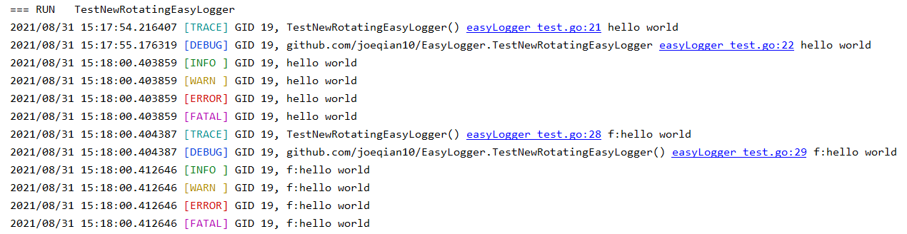
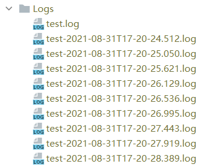

# EasyLogger

Thanks to `github.com/gookit/color` and `github.com/natefinch/lumberjack`, this simple rotating logger with colourful
console output is easy to config and use. Hope you like it!

## Easy Setup

```go
package main

import (
	"log"
	"testing"
)

func TestNewRotatingEasyLogger(t *testing.T) {
	l := NewRotatingEasyLogger(
		"./Logs/test.log",           // log currentFile name
		1,                           // max currentFile size in MB
		30,                          // max currentFile backup days
		30,                          // max backup currentFile number
		true,                        // use local time
		false,                       // use compression for backup files
		log.Ldate|log.Lmicroseconds, // log line flag
		"",                          // logger name
		true,                        // use console output at the same time
	)

	for i := 0; i < 10000; i++ {
		l.Trace("hello world")
		l.Debug("hello world")
		l.Info("hello world")
		l.Warn("hello world")
		l.Error("hello world")
		l.Fatal("hello world")

		l.Tracef("f:%s", "hello world")
		l.Debugf("f:%s", "hello world")
		l.Infof("f:%s", "hello world")
		l.Warnf("f:%s", "hello world")
		l.Errorf("f:%s", "hello world")
		l.Fatalf("f:%s", "hello world")
	}
}
```

## Log Example


